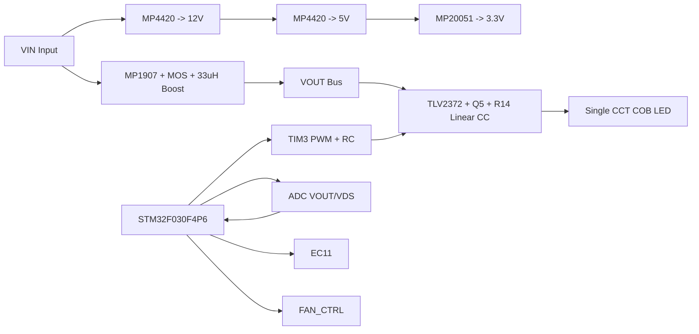

# Photography Fill Light

> 开源单色温 COB 摄影补光灯控制工程  
> Open-Source Single-CCT COB Fill Light Project

单色温 COB 摄影补光灯控制开源项目，基于 `STM32F030F4P6TR`，当前本地文件对应的是一个面向 `60W-80W` 功率段的工程样机。

## 目录

- [1. 项目简介](#1-项目简介)
- [2. MPS 大学计划](#2-mps-大学计划)
- [3. 项目速览](#3-项目速览)
- [4. 硬件设计](#4-硬件设计)
  - [4.4 设计亮点](#44-设计亮点)
- [5. 软件设计](#5-软件设计)
- [6. 快速开始](#6-快速开始)
- [7. 项目结构](#7-项目结构)
- [8. 可扩展方向](#8-可扩展方向)
- [9. 许可证说明](#9-许可证说明)

---

## 1. 项目简介

这是一个面向摄影补光灯的控制板项目，不追求"参数堆料"，而是优先解决下面这些实际问题：

- 亮度调节要稳定
- 相机拍摄时不能出现明显闪烁
- 功率链路和控制链路清晰，便于调试和复刻
- 关键风险点可测量

当前方案采用分层控制架构：



这个架构的核心：

- `Boost` 负责母线电压
- 模拟恒流负责 LED 电流
- MCU 负责目标值、软启动、保护和人机交互

每一层职责明确，出了问题容易定位。

---

## 2. MPS 大学计划

### 2.1 申请说明

本项目使用 MPS 器件搭建，MPS 中国大学计划面向高校教学、科研与竞赛项目，适合本项目所用电源管理相关器件申请。若需要 `MP4420`、`MP1907`、`MP20051` 等样片，可通过对应入口申请。

- 在校大学生：使用 [MPS 大学计划](https://www.monolithicpower.cn/cn/support/mps-cn-university.html)
- 非在校个人开发者：使用 [MPSNOW](https://www.monolithicpower.cn/cn/support/mps-now.html)
- 申请备注：`Photography-Fill-Light`

### 2.2 二维码入口

{width=330}

### 2.3 本项目使用的 MPS 器件

| 模块        | 器件型号         | 说明            |
| --------- | ------------ | ------------- |
| 12V/5V 电源 | `MP4420`     | 降压芯片，给运放和驱动供电 |
| 3.3V 电源   | `MP20051`    | LDO，MCU 供电    |
| Boost 驱动  | `MP1907GQ-Z` | 驱动外部 MOS 和电感  |
| 风扇开关      | `AO3400A`    | MOSFET，低边风扇驱动 |

---

## 3. 项目速览

### 3.1 核心配置

当然，如果你有兴趣自己设计机械散热，本设计的板子跑个100多W是没什么问题的。

| 项目项   | 当前版本                               |
| ----- | ---------------------------------- |
| 项目名称  | `Photography Fill Light`           |
| MCU   | `STM32F030F4P6TR`                  |
| 输入供电  | 宽压 `VIN` 输入，板上生成 `12V / 5V / 3.3V` |
| 光源类型  | 单色温 `COB LED`                      |
| 调光方式  | `EC11` 编码器旋钮 + 按压开关                |
| 功率架构  | `Boost + 模拟恒流`                     |
| 目标功率段 | `60W-80W`                          |
| 固件架构  | 裸机状态机 + `ADC + DMA + PWM + PI`     |

### 3.2 功能特性

- 单色温亮度调节
- `EC11` 旋钮调光，长按开关机
- `TIM3 PWM + RC` 生成电流参考，不额外上 DAC 芯片
- `ADC + DMA` 采样 `VOUT / VDS`
- 裸机状态机：待机 / 软启动 / 运行 / 故障
- `Boost` 动态余量控制
- 过压保护
- 风扇联动控制

---

## 4. 硬件设计

### 4.1 电源架构

板级电源链路：

```
VIN -> MP4420 -> 12V -> MP4420 -> 5V -> MP20051 -> 3.3V
```

当前版本是宽压输入控制板，适用于 `60W-80W` 功率段补光灯。

### 4.2 LED 驱动方式

当前方案不是"MCU 低频 PWM 直接斩波 LED"，而是：

1. `MP1907 + 外部 MOS + 33uH` 构成 `Boost`
2. `TLV2372 + Q5 + 0.1R` 构成模拟恒流级
3. `TIM3_CH2` 通过 `PWM + RC` 生成电流参考

这样做的好处：输出更接近连续光，更适合视频和拍照场景。

### 4.3 主要 BOM

| 模块        | 当前器件                       | 作用                             |
| --------- | -------------------------- | ------------------------------ |
| MCU       | `STM32F030F4P6TR`          | `PWM / ADC / DMA / 状态机 / EC11` |
| 用户交互      | `EC11`                     | 亮度调节 + 按压开关机                   |
| 12V/5V 电源 | `MP4420`                   | 降压供电                           |
| 3.3V 电源   | `MP20051`                  | LDO，MCU 供电                     |
| Boost 驱动  | `MP1907GQ-Z`               | 驱动外部 MOS 和电感                   |
| LED 恒流    | `TLV2372 + Q5 + R14(0.1R)` | 模拟恒流输出                         |

### 4.4 设计亮点

本项目在硬件与固件协同设计上，有三个值得关注的工程决策：

#### 4.4.1 线性 MOS 选型

功率级 `Q5` 选用 `IXTH30N50L2`（50V/0.1Ω N-MOS），配合 0.1Ω 采样电阻构成模拟恒流环。

关键关系：

```
Vsense = Iled × 0.1Ω
Vds_true = Vdrain_gnd - Vsense
```

`Vds_true` 才是真正决定 MOS 工作区的量，而非 `Vdrain_gnd` 单独值。设计手册详见 [`补光灯设计手册.pdf`](docs/补光灯设计手册.pdf)。

#### 4.4.2 动态余量控制

固件已实现动态余量策略：高亮度时让 Q5 接近全开，低亮度时保留更大调节余量。

当前公式（简化线性版）：

```
Vds_keepalive_target_mv = 850 - 0.65 × light_dac_target_permille
```

限幅范围：`200mV ~ 800mV`

亮度分段查表：

| 亮度 (permille) | Vds_keepalive_target |
| ------------- | -------------------- |
| 0~150         | 800mV                |
| 151~350       | 650mV                |
| 351~600       | 500mV                |
| 601~850       | 350mV                |
| 851~1000      | 200mV                |

详见 [`docs/DYNAMIC_HEADROOM_STRATEGY.md`](docs/DYNAMIC_HEADROOM_STRATEGY.md)。

#### 4.4.3 整数优化

`STM32F030F4P6` 无硬件 FPU，固件坚持整数运算避免软件浮点开销：

- **Q8 滤波**：`raw_q8 = ((uint32_t)raw) << 8`（`program.c`）
- **Q15 PI 控制器**：`DRV_PID_Q15_SHIFT = 15`（`drv_pid.c`）
- **ADC 标定**：三点线性拟合全用整数 `VOUT_CAL_SLOPE_NUM = 127237`

> "坚持整数运算，避开 F030 的软件浮点开销" — `program.c`

详见 [`补光灯设计手册.pdf`](docs/补光灯设计手册.pdf)。

---

## 5. 软件设计

### 5.1 裸机还是 RTOS

当前项目采用裸机，不上 RTOS。

原因：

- 任务规模还不需要 RTOS
- `STM32F030F4P6` 资源有限
- 控制时序更容易看清
- 对量产类电源控制板，少一层复杂性就是少一层风险

### 5.2 状态机

系统包含四个状态：

| 状态           | 说明       |
| ------------ | -------- |
| `STANDBY`    | 待机，等待开机  |
| `SOFT_START` | 软启动，拉升余量 |
| `RUNNING`    | 正常运行     |
| `FAULT`      | 故障保护     |

### 5.3 PWM 资源分配

| 定时器        | 作用             | 当前频率     |
| ---------- | -------------- | -------- |
| `TIM1`     | `Boost` 互补 PWM | `100kHz` |
| `TIM3_CH2` | 伪 DAC PWM      | `48kHz`  |
| `TIM14`    | 控制节拍           | `2kHz`   |

---

## 6. 快速开始

### 6.1 开发环境

- IDE：`Keil MDK-ARM`
- 工程文件：`program/MDK-ARM/Fill_Light.uvprojx`
- CubeMX 工程：`program/Fill_Light.ioc`

### 6.2 编译步骤

1. 打开 `program/MDK-ARM/Fill_Light.uvprojx`
2. 选择目标 `Fill_Light`
3. 确认器件包 `Keil.STM32F0xx_DFP`
4. 编译输出：
   - `program/MDK-ARM/Fill_Light/Fill_Light.axf`
   - `program/MDK-ARM/Fill_Light/Fill_Light.hex`

### 6.3 上电运行

- 上电后默认待机
- 长按 `EC11` 进入运行
- 旋转 `EC11` 调节亮度
- 系统会先软启动，再进入正常运行

---

## 7. 项目结构

```text
.
├─ circurit/                 原理图、Gerber
├─ datasheet/                器件规格书、网表
├─ docs/                     设计手册、策略文档、图片资源
├─ hot_design/               热设计估算脚本与结果
├─ program/
│  ├─ Core/                  CubeMX 初始化代码
│  ├─ app/                   状态机、EC11、PI、控制逻辑
│  ├─ Drivers/               HAL / CMSIS
│  └─ MDK-ARM/               Keil 工程与编译输出
└─ simulation/               仿真模型
```

建议优先看：

- `docs/CURRENT_OPERATION_MANUAL.md`
- `docs/DYNAMIC_HEADROOM_STRATEGY.md`
- `hot_design/thermal_report.md`
- `program/app/state_machine.c`

---

## 8. 可扩展方向

- 加双色温通道
- 加无线控制或上位机参数配置
- 风扇升级为温控 PWM
- 增加更完整的开路 / 过热 / 异常采样保护
- 亮度曲线加入 gamma 校正
- 继续收敛量产版本 BOM

---

## 9. 许可证说明

本项目基于 **GNU General Public License v3.0 (GPL 3.0)** 开源许可协议发布。

详细内容请参阅本仓库根目录下的 [`LICENSE`](LICENSE) 文件。

### 概要

- **允许**：自由使用、修改、商业衍生
- **要求**：衍生作品必须同样以 GPL 3.0 发布，并保留源码
- **禁止**：不以任何方式提供源码

### 引用方式

```text
Photography Fill Light
Copyright (C) 2026 MPS China University Program
This program is free software: you can redistribute it and/or modify
it under the terms of the GNU General Public License as published by
the Free Software Foundation, either version 3 of the License.
```
