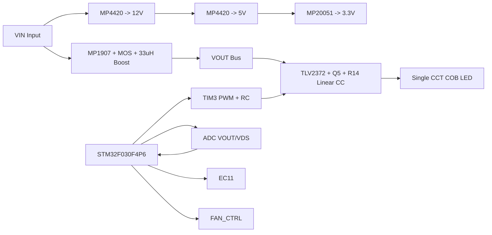

# Photography Fill Light

> 面向 `60W-80W` 单色温 COB 的低成本摄影补光灯控制板  
> `STM32F030F4P6TR` + `Boost + 模拟恒流` + `EC11`

本项目为面向 `60W-80W` 单色温 COB 的摄影补光灯控制板开源工程。  
当前版本对应一套已完成主链路联调的工程样机，已实现 `EC11` 交互、软启动、Boost 母线控制、风扇联动、基础保护框架和仿真验证。

选择线性恒流级的主要原因如下：

1. 避免电流型 `Boost` 控制中的右半平面零点问题，降低控制难度

2. 降低可见频闪风险

3. 为后续共阳极 `COB` 和双色温无极调节方案提供验证基础

## 1. 项目速览

| 项目    | 当前版本                           |
| ----- | ------------------------------ |
| 项目名称  | `Photography Fill Light`       |
| 目标功率段 | `60W-80W`                      |
| 光源类型  | 单色温 `COB LED`                  |
| 主控    | `STM32F030F4P6TR`              |
| 调光方式  | `EC11` 编码器旋钮 + 按压开关            |
| 功率架构  | `Boost + 模拟恒流`                 |
| 电流参考  | `TIM3 PWM + RC` 伪 DAC          |
| 固件架构  | 裸机状态机 + `ADC + DMA + PWM + PI` |
| 项目定位  | 优先把亮度稳定、低闪烁、易调试、低成本这几件事做好      |

## 2. MPS大学计划

本项目的器件选型与样片获取主要依托 MPS 中国大学计划推进。当前方案中使用的 MPS 器件包括 `MP4420`、`MP20051`、`MP1907GQ-Z` 等电源管理与驱动器件。

### 2.1 申请说明

MPS 中国大学计划面向高校教学、科研与竞赛项目，适合本项目所需器件与样片申请。

- 在校大学生：使用 [MPS大学计划](https://www.monolithicpower.cn/cn/support/mps-cn-university.html)
- 非在校个人开发者：使用 [MPSNOW](https://www.monolithicpower.cn/cn/support/mps-now.html)
- 申请备注：`Photography-Fill-Light`

### 2.2 当前方案中的 MPS 器件

| 模块        | 器件型号         | 说明            |
| --------- | ------------ | ------------- |
| 12V/5V 电源 | `MP4420`     | 降压芯片，给运放和驱动供电 |
| 3.3V 电源   | `MP20051`    | LDO，MCU 供电    |
| Boost 驱动  | `MP1907GQ-Z` | 驱动外部 MOS 和电感  |

### 2.3 二维码入口

<p align="center">
  
</p>

## 3. 实物图

<table>
  <tr>
    <td align="center">
      
    </td>
    <td align="center">
      
    </td>
  </tr>
  <tr>
    <td align="center">工程样机实拍</td>
    <td align="center">侧视 / 结构视角</td>
  </tr>
</table>

当前样机为工程验证版本，重点用于控制板、电源链路、散热路径和调光逻辑的联调，不对应最终整机外观形态。

## 4. 方案特点

- 采用 `Boost + 模拟恒流` 分层控制，适用于视频和拍照场景的连续光输出。
- 控制链路与功率链路分离，便于问题定位和后续调试。
- 关键量按可测量工程变量组织，包括 `VOUT`、`Q5 drain-to-gnd`、动态余量目标和风扇联动状态。
- 已提供设计手册、动态余量说明、热设计估算和仿真模型，对应文件位于 [`docs/补光灯设计手册.pdf`](docs/补光灯设计手册.pdf)、[`docs/CURRENT_OPERATION_MANUAL.md`](docs/CURRENT_OPERATION_MANUAL.md)、[`docs/DYNAMIC_HEADROOM_STRATEGY.md`](docs/DYNAMIC_HEADROOM_STRATEGY.md)、[`hot_design/thermal_report.md`](hot_design/thermal_report.md) 和 [`simulation/`](simulation/)。

## 5. 低成本设计特点

本方案通过控制架构和器件配置控制 BOM 成本，当前实现包括：

- `TIM3_CH2 + PWM + RC` 直接生成电流参考，不额外上 DAC 芯片，少一颗器件、少一段调试链路。
- 主控选 `STM32F030F4P6TR`，并坚持整数控制，避免为了浮点计算上更高档 MCU。
- `Boost` 负责慢速给母线“补刚好够用的电压”，模拟恒流级负责快速稳流，不需要一开始就上更复杂的大闭环方案。
- `EC11 + 裸机状态机` 就能完成亮度调节、开关机和基本控制节拍，结构简单，适合量产前样机和开源复刻。

按 [`docs/补光灯设计手册.pdf`](docs/补光灯设计手册.pdf) 在 `2026-03-22` 的当前估算，成本拆分如下:

| 项目              | 估算成本      |
| --------------- | --------- |
| 核心电子 BOM 小计     | `13.71 元` |
| 灯珠、结构与散热 BOM 小计 | `25.00 元` |

按当前估算，核心电子 BOM 为 `13.71 元`，灯珠、结构与散热 BOM 为 `25.00 元`。控制板成本主要集中在低压供电、Boost 驱动、线性恒流级和主控部分；整机成本主要来自光源、供电附件和结构件。

## 6. 关键设计说明

### 6.1 `Boost + 模拟恒流` 的分层控制

当前 LED 驱动链路为：

1. `MP1907 + 外部 MOS + 33uH` 构成 `Boost`
2. `TLV2372 + Q5 + 0.1R` 构成模拟恒流级
3. `TIM3_CH2` 通过 `PWM + RC` 生成电流参考

该结构的主要作用包括：

- LED 看到的是更接近连续的电流
- 视频拍摄更容易避开明显闪烁
- 数字控制和模拟稳流各管一层，调试难度更低

### 6.2 动态余量控制

动态余量控制的目标不是让 `Q5` 长期承受大压差，而是让 `Boost` 只给线性恒流级保留“最小可调余量”。

关键关系:

```text
Vsense = Iled x 0.1 ohm
Vds_true = Vdrain_gnd - Vsense
```

其中，判断 `Q5` 是否仍处于可调区的关键量不是单独的 `Vdrain_gnd`，而是 `Vds_true`。

当前文档给出的动态余量策略包括：

- 低亮度时，多留一点余量，先保稳定
- 高亮度时，把 `Q5` 尽量压到接近全开，减少线性区损耗和发热
- 但不会把 `Q5` 直接硬顶死，避免模拟恒流环失去调节权

这部分可继续参考:

- [`docs/CURRENT_OPERATION_MANUAL.md`](docs/CURRENT_OPERATION_MANUAL.md)
- [`docs/DYNAMIC_HEADROOM_STRATEGY.md`](docs/DYNAMIC_HEADROOM_STRATEGY.md)

### 6.3 整数控制优化

`STM32F030F4P6TR` 没有硬件 FPU，所以当前固件坚持整数实现，避免软件浮点带来的资源浪费。

- `ADC + DMA` 负责采样
- `PI` 控制器采用定点实现
- 亮度、电压和调试量统一按工程量输出

当前实现已在低成本 MCU 上完成控制节拍、采样链路和交互逻辑联调。

## 7. 运行验证

运行验证视频可参考小红书笔记：自制补光灯测试 http://xhslink.com/o/AVei6cEGQPr

<table>
  <tr>
    <td align="center">
      
    </td>
    <td align="center">
      
    </td>
  </tr>
  <tr>
    <td align="center">热成像记录</td>
    <td align="center">仿真运行截图</td>
  </tr>
</table>

<p align="center">
  
</p>
<p align="center">样机运行图</p>

- 当前已经有热成像记录，截图中最高温约 `49.2°C`，但这只是当时工况下的阶段性记录，不等于最终热设计结论。
- [`hot_design/thermal_report.md`](hot_design/thermal_report.md) 目前仍是估算版，不是最终热签核。
- 现有热设计估算建议: 如果继续维持 `60W-80W` 功率级，主散热器建议做到 **`<= 0.35 C/W` 且有强制风冷**。
- 仿真模型已用于辅助分析启动过程、余量变化和线性恒流级行为，便于后续继续迭代控制参数。

## 8. 当前已经实现的功能

- 单色温亮度调节
- `EC11` 旋钮调光，长按开关机
- `TIM3 PWM + RC` 伪 DAC 输出
- `ADC + DMA` 采样 `VOUT / VDS`
- 裸机状态机: `STANDBY / SOFT_START / RUNNING / FAULT`
- Boost 动态母线目标控制
- 过压保护框架
- 风扇联动控制

## 9. 当前版本的边界

作为一个适合继续开源迭代的工程样机，当前版本也有明确边界:

- 还不是最终整机形态，机械结构、外壳和量产散热还可以继续打磨
- 过流、过温、开路等保护逻辑还值得继续补齐
- 效率、照度、噪声和长时间热稳定性还需要更多实测数据
- 热设计文档目前是估算版，后续应逐步替换成实测数据

## 10. 硬件架构



该架构中的层级分工如下：

- `Boost` 负责母线电压
- 模拟恒流级负责 LED 电流
- MCU 负责目标值、软启动、保护和人机交互

## 11. 仓库结构

```text
.
├─ circurit/                 原理图、Gerber
├─ datasheet/                器件规格书、网表
├─ docs/                     设计手册、策略文档、图片资源
├─ hot_design/               热设计估算脚本与结果
├─ program/
│  ├─ Core/                  CubeMX 初始化代码
│  ├─ app/                   状态机、EC11、PI、控制逻辑
│  ├─ Drivers/               HAL / CMSIS
│  └─ MDK-ARM/               Keil 工程与编译输出
└─ simulation/               仿真模型
```

建议优先看:

- [`docs/补光灯设计手册.pdf`](docs/补光灯设计手册.pdf)
- [`docs/CURRENT_OPERATION_MANUAL.md`](docs/CURRENT_OPERATION_MANUAL.md)
- [`docs/DYNAMIC_HEADROOM_STRATEGY.md`](docs/DYNAMIC_HEADROOM_STRATEGY.md)
- [`hot_design/thermal_report.md`](hot_design/thermal_report.md)
- [`program/app/state_machine.c`](program/app/state_machine.c)

## 12. 快速开始

### 12.1 开发环境

- IDE: `Keil MDK-ARM`
- 工程文件: `program/MDK-ARM/Fill_Light.uvprojx`
- CubeMX 工程: `program/Fill_Light.ioc`

### 12.2 编译步骤

1. 打开 `program/MDK-ARM/Fill_Light.uvprojx`
2. 选择目标 `Fill_Light`
3. 确认器件包 `Keil.STM32F0xx_DFP`
4. 编译输出:
   - `program/MDK-ARM/Fill_Light/Fill_Light.axf`
   - `program/MDK-ARM/Fill_Light/Fill_Light.hex`

### 12.3 上电运行

- 上电后默认待机
- 长按 `EC11` 进入运行
- 旋转 `EC11` 调节亮度
- 系统会先软启动，再进入正常运行

## 13. 开源说明

本项目当前按 **GNU General Public License v3.0 (GPL 3.0)** 进行开源发布，仓库根目录已补充正式的 [`LICENSE`](LICENSE) 文件。  
如果后续发布到立创广场或其他开源平台，建议保持 README 与许可证说明一致，避免后续授权边界不清。
